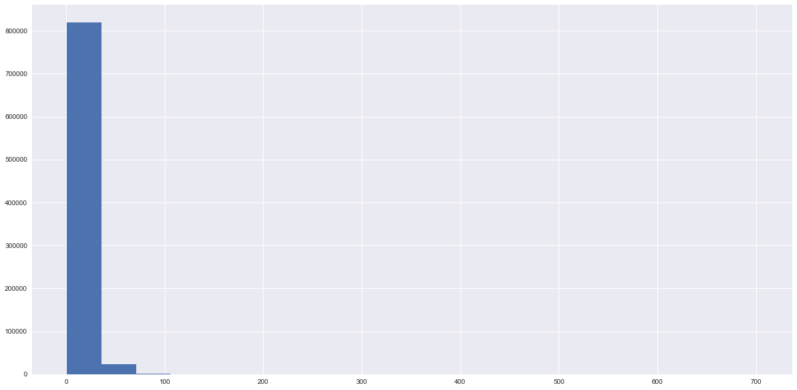

# Analysis of Chicago's Ride-Hailing trip data

## Introduction

The city of Chicago provides data on individual Uber trips, registered vehicles and Uber drivers since 2018.

The data can be found [here]. (https://data.cityofchicago.org/Transportation/Transportation-Network-Providers-Trips/m6dm-c72p)

### Import neccessary packages


```python
import matplotlib.pyplot as plt
import pandas as pd
import numpy as np
```


```python
%matplotlib inline
```

### Import the data

To save time let us read 1 million rows only, but in the future I will work on the entire dataset.


```python
trip_df = pd.read_csv('dataset/Transportation_Network_Providers_-_Trips.csv', nrows=1000000)
```


```python
trip_df.head(5)
```


<div>
<style scoped>
    .dataframe tbody tr th:only-of-type {
        vertical-align: middle;
    }

    .dataframe tbody tr th {
        vertical-align: top;
    }

    .dataframe thead th {
        text-align: right;
    }
</style>
<table border="1" class="dataframe">
  <thead>
    <tr style="text-align: right;">
      <th></th>
      <th>Trip ID</th>
      <th>Trip Start Timestamp</th>
      <th>Trip End Timestamp</th>
      <th>Trip Seconds</th>
      <th>Trip Miles</th>
      <th>Pickup Census Tract</th>
      <th>Dropoff Census Tract</th>
      <th>Pickup Community Area</th>
      <th>Dropoff Community Area</th>
      <th>Fare</th>
      <th>...</th>
      <th>Additional Charges</th>
      <th>Trip Total</th>
      <th>Shared Trip Authorized</th>
      <th>Trips Pooled</th>
      <th>Pickup Centroid Latitude</th>
      <th>Pickup Centroid Longitude</th>
      <th>Pickup Centroid Location</th>
      <th>Dropoff Centroid Latitude</th>
      <th>Dropoff Centroid Longitude</th>
      <th>Dropoff Centroid Location</th>
    </tr>
  </thead>
  <tbody>
    <tr>
      <th>0</th>
      <td>022ad3b7f1320d4e52cce3d5931eb0a0cee16c48</td>
      <td>11/01/2018 08:45:00 AM</td>
      <td>11/01/2018 09:30:00 AM</td>
      <td>3,140</td>
      <td>38.541928</td>
      <td>NaN</td>
      <td>1.703198e+10</td>
      <td>NaN</td>
      <td>56.0</td>
      <td>47.5</td>
      <td>...</td>
      <td>9.1</td>
      <td>66.6</td>
      <td>False</td>
      <td>1</td>
      <td>NaN</td>
      <td>NaN</td>
      <td>NaN</td>
      <td>41.785999</td>
      <td>-87.750934</td>
      <td>POINT (-87.7509342894 41.785998518)</td>
    </tr>
    <tr>
      <th>1</th>
      <td>0377167460a4d5d5e015c642b460e56ac88dab71</td>
      <td>11/01/2018 02:00:00 AM</td>
      <td>11/01/2018 02:15:00 AM</td>
      <td>1,031</td>
      <td>5.321918</td>
      <td>NaN</td>
      <td>NaN</td>
      <td>70.0</td>
      <td>NaN</td>
      <td>10.0</td>
      <td>...</td>
      <td>2.5</td>
      <td>12.5</td>
      <td>False</td>
      <td>1</td>
      <td>41.745758</td>
      <td>-87.708366</td>
      <td>POINT (-87.7083657043 41.7457577128)</td>
      <td>NaN</td>
      <td>NaN</td>
      <td>NaN</td>
    </tr>
    <tr>
      <th>2</th>
      <td>03a2ac30a46af881e6a2e6af06a3a779b67c0802</td>
      <td>11/01/2018 08:15:00 PM</td>
      <td>11/01/2018 09:15:00 PM</td>
      <td>4,125</td>
      <td>49.870653</td>
      <td>1.703108e+10</td>
      <td>NaN</td>
      <td>8.0</td>
      <td>NaN</td>
      <td>62.5</td>
      <td>...</td>
      <td>3.8</td>
      <td>66.3</td>
      <td>False</td>
      <td>1</td>
      <td>41.892042</td>
      <td>-87.631864</td>
      <td>POINT (-87.6318639497 41.8920421365)</td>
      <td>NaN</td>
      <td>NaN</td>
      <td>NaN</td>
    </tr>
    <tr>
      <th>3</th>
      <td>03fe17b0509941aa04744e9e4478ed5ded56b2eb</td>
      <td>11/01/2018 03:45:00 AM</td>
      <td>11/01/2018 04:15:00 AM</td>
      <td>1,229</td>
      <td>11.662228</td>
      <td>1.703183e+10</td>
      <td>NaN</td>
      <td>22.0</td>
      <td>NaN</td>
      <td>7.5</td>
      <td>...</td>
      <td>2.5</td>
      <td>10.0</td>
      <td>True</td>
      <td>3</td>
      <td>41.916005</td>
      <td>-87.675095</td>
      <td>POINT (-87.6750951155 41.9160052737)</td>
      <td>NaN</td>
      <td>NaN</td>
      <td>NaN</td>
    </tr>
    <tr>
      <th>4</th>
      <td>040590c0bf5b22f8ccf7d8f19873c612bebfd480</td>
      <td>11/01/2018 05:00:00 PM</td>
      <td>11/01/2018 06:00:00 PM</td>
      <td>3,383</td>
      <td>12.272990</td>
      <td>NaN</td>
      <td>1.703184e+10</td>
      <td>NaN</td>
      <td>32.0</td>
      <td>27.5</td>
      <td>...</td>
      <td>2.5</td>
      <td>30.0</td>
      <td>False</td>
      <td>1</td>
      <td>NaN</td>
      <td>NaN</td>
      <td>NaN</td>
      <td>41.880994</td>
      <td>-87.632746</td>
      <td>POINT (-87.6327464887 41.8809944707)</td>
    </tr>
  </tbody>
</table>
<p>5 rows × 21 columns</p>
</div>


```python
trip_df.shape
```


    (1000000, 21)


```python
trip_df.dtypes
```


    Trip ID                        object
    Trip Start Timestamp           object
    Trip End Timestamp             object
    Trip Seconds                   object
    Trip Miles                    float64
    Pickup Census Tract           float64
    Dropoff Census Tract          float64
    Pickup Community Area         float64
    Dropoff Community Area        float64
    Fare                          float64
    Tip                             int64
    Additional Charges            float64
    Trip Total                    float64
    Shared Trip Authorized           bool
    Trips Pooled                    int64
    Pickup Centroid Latitude      float64
    Pickup Centroid Longitude     float64
    Pickup Centroid Location       object
    Dropoff Centroid Latitude     float64
    Dropoff Centroid Longitude    float64
    Dropoff Centroid Location      object
    dtype: object


### Remove some features

We then remove features that are redundant or not relevant to the analysis, such as Census Tract and Community area and centroid location.


```python
col_names = list(trip_df.columns)
trip_sub_df = trip_df.drop(columns=col_names[5:9]+[col_names[17], col_names[20]])
trip_sub_df.dtypes
```


    Trip ID                        object
    Trip Start Timestamp           object
    Trip End Timestamp             object
    Trip Seconds                   object
    Trip Miles                    float64
    Fare                          float64
    Tip                             int64
    Additional Charges            float64
    Trip Total                    float64
    Shared Trip Authorized           bool
    Trips Pooled                    int64
    Pickup Centroid Latitude      float64
    Pickup Centroid Longitude     float64
    Dropoff Centroid Latitude     float64
    Dropoff Centroid Longitude    float64
    dtype: object


### Remove missing values

Since it is unreasonable to fill missing values for time and geo locations, we are going to drop any row that contains missing values. However, missing values in the lat-lon indicate trips either starting or ending outside the city's area and if we are interested to analyze that we can keep them.


```python
trip_sub_df.dropna(inplace=True)
trip_sub_df.shape
```


    (843414, 15)


### Convert to datetime units


```python
trip_time = trip_sub_df.iloc[:,1]
trip_sub_df.iloc[:,1] = pd.to_datetime(trip_time, format='%m/%d/%Y %I:%M:%S %p', errors='coerce')
trip_time = trip_sub_df.iloc[:,2]
trip_sub_df.iloc[:,2] = pd.to_datetime(trip_time, format='%m/%d/%Y %I:%M:%S %p', errors='coerce')
trip_sub_df.dtypes
```


    Trip ID                               object
    Trip Start Timestamp          datetime64[ns]
    Trip End Timestamp            datetime64[ns]
    Trip Seconds                          object
    Trip Miles                           float64
    Fare                                 float64
    Tip                                    int64
    Additional Charges                   float64
    Trip Total                           float64
    Shared Trip Authorized                  bool
    Trips Pooled                           int64
    Pickup Centroid Latitude             float64
    Pickup Centroid Longitude            float64
    Dropoff Centroid Latitude            float64
    Dropoff Centroid Longitude           float64
    dtype: object


```python
trip_sub_df.iloc[1:5,[1,2]]
```


<div>
<style scoped>
    .dataframe tbody tr th:only-of-type {
        vertical-align: middle;
    }

    .dataframe tbody tr th {
        vertical-align: top;
    }

    .dataframe thead th {
        text-align: right;
    }
</style>
<table border="1" class="dataframe">
  <thead>
    <tr style="text-align: right;">
      <th></th>
      <th>Trip Start Timestamp</th>
      <th>Trip End Timestamp</th>
    </tr>
  </thead>
  <tbody>
    <tr>
      <th>553</th>
      <td>2018-11-01 19:15:00</td>
      <td>2018-11-01 19:30:00</td>
    </tr>
    <tr>
      <th>554</th>
      <td>2018-11-01 11:45:00</td>
      <td>2018-11-01 12:00:00</td>
    </tr>
    <tr>
      <th>767</th>
      <td>2018-11-01 12:45:00</td>
      <td>2018-11-01 13:15:00</td>
    </tr>
    <tr>
      <th>772</th>
      <td>2018-11-01 09:30:00</td>
      <td>2018-11-01 10:00:00</td>
    </tr>
  </tbody>
</table>
</div>


## Exploratory Data Analysis

### Histogram plots

First, let us see how the distribution of the trip duration and trip length(miles) looks like.

**Histogram for trip duation**


```python
def histplot (x):
    fig, ax=plt.subplots(1)
    fig.set_size_inches(20,10)
    plt.hist(x, bins=20)
```


```python
histplot(trip_sub_df['Trip Seconds'])
```


**Histogram for trip length**


```python
histplot(trip_sub_df['Trip Miles'])
```


**Histogram plot  for trip's total charge**


```python
histplot(trip_sub_df['Trip Total'])
```





Let us generate pairplot for selected variable using seaborn package.


```python
import seaborn as sns
#sns.set(color_codes=True)
sns.set_palette("Set2")
sns.set(rc={'figure.figsize':(16,16)})
sns.pairplot(trip_sub_df, vars=['Trip Seconds', 'Trip Miles', 'Trip Total'])
```


    ---------------------------------------------------------------------------

    ValueError                                Traceback (most recent call last)

    <ipython-input-31-8469f33c19ba> in <module>()
          4 #fig, ax = plt.subplots(figsize=(16,16))
          5 sns.set(rc={'figure.figsize':(16,16)})
    ----> 6 sns.pairplot(trip_sub_df, vars=['Trip Seconds', 'Trip Miles', 'Trip Total'])
    

    ~\AppData\Local\Continuum\anaconda3\lib\site-packages\seaborn\axisgrid.py in pairplot(data, hue, hue_order, palette, vars, x_vars, y_vars, kind, diag_kind, markers, size, aspect, dropna, plot_kws, diag_kws, grid_kws)
       2036     if grid.square_grid:
       2037         if diag_kind == "hist":
    -> 2038             grid.map_diag(plt.hist, **diag_kws)
       2039         elif diag_kind == "kde":
       2040             diag_kws["legend"] = False
    

    ~\AppData\Local\Continuum\anaconda3\lib\site-packages\seaborn\axisgrid.py in map_diag(self, func, **kwargs)
       1352                 else:
       1353                     func(vals, color=color, histtype="barstacked",
    -> 1354                          **kwargs)
       1355             else:
       1356                 for k, label_k in enumerate(self.hue_names):
    

    ~\AppData\Local\Continuum\anaconda3\lib\site-packages\matplotlib\pyplot.py in hist(x, bins, range, density, weights, cumulative, bottom, histtype, align, orientation, rwidth, log, color, label, stacked, normed, hold, data, **kwargs)
       3002                       histtype=histtype, align=align, orientation=orientation,
       3003                       rwidth=rwidth, log=log, color=color, label=label,
    -> 3004                       stacked=stacked, normed=normed, data=data, **kwargs)
       3005     finally:
       3006         ax._hold = washold
    

    ~\AppData\Local\Continuum\anaconda3\lib\site-packages\matplotlib\__init__.py in inner(ax, *args, **kwargs)
       1708                     warnings.warn(msg % (label_namer, func.__name__),
       1709                                   RuntimeWarning, stacklevel=2)
    -> 1710             return func(ax, *args, **kwargs)
       1711         pre_doc = inner.__doc__
       1712         if pre_doc is None:
    

    ~\AppData\Local\Continuum\anaconda3\lib\site-packages\matplotlib\axes\_axes.py in hist(***failed resolving arguments***)
       6181             color = mcolors.to_rgba_array(color)
       6182             if len(color) != nx:
    -> 6183                 raise ValueError("color kwarg must have one color per dataset")
       6184 
       6185         # If bins are not specified either explicitly or via range,
    

    ValueError: color kwarg must have one color per dataset


```python
import matplotlib as mlp
mlp.rcParams['axes.labelsize'] = 16
mlp.rcParams['xtick.labelsize'] = 14
mlp.rcParams['ytick.labelsize'] = 14
```


```python
#import matplotlib.pyplot as plt
pair_plot=pd.plotting.scatter_matrix(trip_sub_df[['Trip Seconds', 'Trip Miles', 'Trip Total']], figsize=(15, 15), marker='o',
                        hist_kwds={'bins': 20}, s=60, alpha=.8)
plt.savefig('pair_plot.png')
```


```python
#times = pd.to_datetime(df.timestamp_col)
s_time = trip_sub_df['Trip Start Timestamp']
start_time_count =trip_sub_df.groupby(s_time.dt.hour)['Trip Start Timestamp'].count()
```


```python
start_time_count.plot.bar(figsize=(15, 6), width=0.8, color='gray')
plt.ylabel('Number of trips')
plt.xlabel('Trip start hour')
plt.title('Daily trip start time pattern', fontsize=18)
plt.savefig('dail_pattern.png')
```


```python
s_time = trip_sub_df['Trip Start Timestamp']
daily_count =trip_sub_df.groupby([s_time.dt.year, s_time.dt.month,s_time.dt.day])['Trip Start Timestamp'].count()
```


```python
daily_count.plot.bar(figsize=(20, 6), width=0.8, color='gray')
plt.ylabel('Number of trips')
plt.xlabel('Trip start hour')
plt.title('Daily trip start time pattern', fontsize=18)
plt.savefig('dail_pattern.png')
```


### Scatter plots

Let us see if there is any relationship between trip's total charge and trip miles and trip duration using scatter plots


```python
def scatter (x,y):
    fig, ax=plt.subplots(1)
    fig.set_size_inches(20,10)
    plt.scatter(x,y)
```

**Scatter plot for trip duration vs trip total charge**


```python
tm = trip_sub_df['Trip Seconds']
trip_sub_df['Trip Seconds'] = pd.to_numeric(tm, errors='coerce')
```


```python
# Check for na values
sum(trip_sub_df['Trip Seconds'].isna())
```


    300209


```python
trip_sub_df.dropna(inplace=True)
trip_sub_df.shape
```


    (543205, 15)


```python
trip_sub_df.to_csv()
```

    IOPub data rate exceeded.
    The notebook server will temporarily stop sending output
    to the client in order to avoid crashing it.
    To change this limit, set the config variable
    `--NotebookApp.iopub_data_rate_limit`.
    


```python
scatter(trip_sub_df['Trip Seconds'],trip_sub_df['Trip Total'])
```


## Can we predict trip's total charge?

We can expect the total trip charge to depend on several factors including duration of the trip, trip mile, time of the  data, traffic condition, etc. Here I will start builing a machine learning model using multiple linear regression. For now I will focus only on the trip's duration and miles. Later on I will add other parameters. 

We start with first splitting the data into training and testing sets.

**Split data into training and testing**


```python
from sklearn.model_selection import train_test_split

X = trip_sub_df[['Trip Seconds', 'Trip Miles']]
y = trip_sub_df['Trip Total']

X_train, X_test, y_train, y_test = train_test_split(X, y, test_size=0.25, random_state=15)
```

**Fit the model**


```python
X.describe()
```


<div>
<style scoped>
    .dataframe tbody tr th:only-of-type {
        vertical-align: middle;
    }

    .dataframe tbody tr th {
        vertical-align: top;
    }

    .dataframe thead th {
        text-align: right;
    }
</style>
<table border="1" class="dataframe">
  <thead>
    <tr style="text-align: right;">
      <th></th>
      <th>Trip Seconds</th>
      <th>Trip Miles</th>
    </tr>
  </thead>
  <tbody>
    <tr>
      <th>count</th>
      <td>543205.000000</td>
      <td>543205.000000</td>
    </tr>
    <tr>
      <th>mean</th>
      <td>581.230725</td>
      <td>2.406742</td>
    </tr>
    <tr>
      <th>std</th>
      <td>225.942054</td>
      <td>1.628304</td>
    </tr>
    <tr>
      <th>min</th>
      <td>0.000000</td>
      <td>0.000000</td>
    </tr>
    <tr>
      <th>25%</th>
      <td>400.000000</td>
      <td>1.222590</td>
    </tr>
    <tr>
      <th>50%</th>
      <td>579.000000</td>
      <td>1.962473</td>
    </tr>
    <tr>
      <th>75%</th>
      <td>766.000000</td>
      <td>3.143331</td>
    </tr>
    <tr>
      <th>max</th>
      <td>999.000000</td>
      <td>32.849356</td>
    </tr>
  </tbody>
</table>
</div>


```python
y.describe()
```


    count    543205.000000
    mean          9.088494
    std           3.353325
    min           0.670000
    25%           7.500000
    50%           8.500000
    75%          10.000000
    max         117.800000
    Name: Trip Total, dtype: float64


```python
from sklearn.linear_model import LinearRegression

reg = LinearRegression().fit(X_train, y_train)
```


```python
# Get the training score
score = reg.score(X_train, y_train)
print(f'Model training score = {score}')

# Get model coefficients
coef = reg.coef_
print(f'Model coefficients = {coef}')

inter = reg.intercept_ 
print(f'Model intercepts = {inter}')
```

    Model training score = 0.37784816740753846
    Model coefficients = [0.00370819 0.85771547]
    Model intercepts = 4.870513008819532
    


```python
# Get the test score
score = reg.score(X_test, y_test)
print(f'Model test score = {score}')
```

    Model test score = 0.3791032052665169
    

The above result indicate that the multiple linear regression doesn't provide a good relationship between the feature. Thus other non-linear models should be tried instead. In addition, other features might need to be added to the model.

### Principal Component Analysis

<h4>Prepare the data to be used for PCA </h4>


```python
import time
#time.mktime(d.timetuple())
start_t = [time.mktime(i.timetuple()) for i in trip_sub_df['Trip Start Timestamp']]
end_t = [time.mktime(i.timetuple()) for i in trip_sub_df['Trip End Timestamp']]
```

    C:\Users\zerualem\AppData\Local\Continuum\anaconda3\lib\site-packages\ipykernel_launcher.py:8: SettingWithCopyWarning: 
    A value is trying to be set on a copy of a slice from a DataFrame.
    Try using .loc[row_indexer,col_indexer] = value instead
    
    See the caveats in the documentation: http://pandas.pydata.org/pandas-docs/stable/indexing.html#indexing-view-versus-copy
      
    C:\Users\zerualem\AppData\Local\Continuum\anaconda3\lib\site-packages\ipykernel_launcher.py:9: SettingWithCopyWarning: 
    A value is trying to be set on a copy of a slice from a DataFrame.
    Try using .loc[row_indexer,col_indexer] = value instead
    
    See the caveats in the documentation: http://pandas.pydata.org/pandas-docs/stable/indexing.html#indexing-view-versus-copy
      if __name__ == '__main__':
    


    Trip Seconds    float64
    Trip Miles      float64
    Trip Total      float64
    Start_t         float64
    End_t           float64
    dtype: object


```python
features = list(trip_sub_df.columns)
X_pca = features[3:5]+[features[8]]
pca_dt = trip_sub_df.loc[:, X_pca]
pca_dt['Start_t'] = start_t
pca_dt['End_t'] = end_t
pca_dt.dtypes
```


    Trip Seconds    float64
    Trip Miles      float64
    Trip Total      float64
    Start_t         float64
    End_t           float64
    dtype: object


<h4>Visualize using pairplot</h4>


```python
import seaborn as sns
sns.pairplot(pca_dt)
```


    <seaborn.axisgrid.PairGrid at 0x2e152890>


```python
plt.show()
```


```python
plt.savefig('pair_plot2.png')
```

<h4>Standardize the data for PCA</h4>


```python
pca_dt.describe()
```


<div>
<style scoped>
    .dataframe tbody tr th:only-of-type {
        vertical-align: middle;
    }

    .dataframe tbody tr th {
        vertical-align: top;
    }

    .dataframe thead th {
        text-align: right;
    }
</style>
<table border="1" class="dataframe">
  <thead>
    <tr style="text-align: right;">
      <th></th>
      <th>Trip Seconds</th>
      <th>Trip Miles</th>
      <th>Trip Total</th>
      <th>Start_t</th>
      <th>End_t</th>
    </tr>
  </thead>
  <tbody>
    <tr>
      <th>count</th>
      <td>543205.000000</td>
      <td>543205.000000</td>
      <td>543205.000000</td>
      <td>5.432050e+05</td>
      <td>5.432050e+05</td>
    </tr>
    <tr>
      <th>mean</th>
      <td>581.230725</td>
      <td>2.406742</td>
      <td>9.088494</td>
      <td>1.543603e+09</td>
      <td>1.543604e+09</td>
    </tr>
    <tr>
      <th>std</th>
      <td>225.942054</td>
      <td>1.628304</td>
      <td>3.353325</td>
      <td>1.494912e+06</td>
      <td>1.494910e+06</td>
    </tr>
    <tr>
      <th>min</th>
      <td>0.000000</td>
      <td>0.000000</td>
      <td>0.670000</td>
      <td>1.541045e+09</td>
      <td>1.541045e+09</td>
    </tr>
    <tr>
      <th>25%</th>
      <td>400.000000</td>
      <td>1.222590</td>
      <td>7.500000</td>
      <td>1.542304e+09</td>
      <td>1.542304e+09</td>
    </tr>
    <tr>
      <th>50%</th>
      <td>579.000000</td>
      <td>1.962473</td>
      <td>8.500000</td>
      <td>1.543650e+09</td>
      <td>1.543650e+09</td>
    </tr>
    <tr>
      <th>75%</th>
      <td>766.000000</td>
      <td>3.143331</td>
      <td>10.000000</td>
      <td>1.544855e+09</td>
      <td>1.544855e+09</td>
    </tr>
    <tr>
      <th>max</th>
      <td>999.000000</td>
      <td>32.849356</td>
      <td>117.800000</td>
      <td>1.546318e+09</td>
      <td>1.546319e+09</td>
    </tr>
  </tbody>
</table>
</div>


```python
pca_dt_std = (pca_dt-pca_dt.mean())/pca_dt.std()
```


```python
pca_dt_std.describe()
```


<div>
<style scoped>
    .dataframe tbody tr th:only-of-type {
        vertical-align: middle;
    }

    .dataframe tbody tr th {
        vertical-align: top;
    }

    .dataframe thead th {
        text-align: right;
    }
</style>
<table border="1" class="dataframe">
  <thead>
    <tr style="text-align: right;">
      <th></th>
      <th>Trip Seconds</th>
      <th>Trip Miles</th>
      <th>Trip Total</th>
      <th>Start_t</th>
      <th>End_t</th>
    </tr>
  </thead>
  <tbody>
    <tr>
      <th>count</th>
      <td>5.432050e+05</td>
      <td>5.432050e+05</td>
      <td>5.432050e+05</td>
      <td>5.432050e+05</td>
      <td>5.432050e+05</td>
    </tr>
    <tr>
      <th>mean</th>
      <td>-3.918783e-17</td>
      <td>-5.781203e-14</td>
      <td>1.120397e-12</td>
      <td>2.101980e-14</td>
      <td>1.959842e-14</td>
    </tr>
    <tr>
      <th>std</th>
      <td>1.000000e+00</td>
      <td>1.000000e+00</td>
      <td>1.000000e+00</td>
      <td>1.000000e+00</td>
      <td>1.000000e+00</td>
    </tr>
    <tr>
      <th>min</th>
      <td>-2.572477e+00</td>
      <td>-1.478067e+00</td>
      <td>-2.510491e+00</td>
      <td>-1.711303e+00</td>
      <td>-1.711695e+00</td>
    </tr>
    <tr>
      <th>25%</th>
      <td>-8.021115e-01</td>
      <td>-7.272303e-01</td>
      <td>-4.737071e-01</td>
      <td>-8.690461e-01</td>
      <td>-8.694367e-01</td>
    </tr>
    <tr>
      <th>50%</th>
      <td>-9.872996e-03</td>
      <td>-2.728417e-01</td>
      <td>-1.754956e-01</td>
      <td>3.160890e-02</td>
      <td>3.121956e-02</td>
    </tr>
    <tr>
      <th>75%</th>
      <td>8.177728e-01</td>
      <td>4.523657e-01</td>
      <td>2.718215e-01</td>
      <td>8.377433e-01</td>
      <td>8.373551e-01</td>
    </tr>
    <tr>
      <th>max</th>
      <td>1.849011e+00</td>
      <td>1.869590e+01</td>
      <td>3.241902e+01</td>
      <td>1.816062e+00</td>
      <td>1.816277e+00</td>
    </tr>
  </tbody>
</table>
</div>


<h4>Fit PCA using sklearn</h4>


```python
from sklearn.decomposition import PCA
pca = PCA(random_state=100)
pca.fit(pca_dt_std)
```


    PCA(copy=True, iterated_power='auto', n_components=None, random_state=100,
      svd_solver='auto', tol=0.0, whiten=False)


```python
print(pca.components_)
```

    [[ 5.80635867e-01  5.96798679e-01  5.46713579e-01  6.23960700e-02
       6.24845547e-02]
     [ 6.31379756e-02  4.51283899e-02  4.45515330e-02 -7.04274405e-01
      -7.04265396e-01]
     [-5.02987937e-01 -2.63604660e-01  8.23083559e-01 -4.92047677e-03
      -4.99626114e-03]
     [-6.37086108e-01  7.56509979e-01 -1.47149175e-01 -8.92514155e-03
      -9.02248279e-03]
     [-1.07536507e-04  3.17053403e-07 -5.11927861e-07 -7.07107081e-01
       7.07106473e-01]]
    


```python
print(pca.explained_variance_)
```

    [2.21427461e+00 1.99866626e+00 4.83603266e-01 3.03455830e-01
     3.25518918e-08]
    


```python
plt.bar([str(x) for x in range(1,6)],pca.explained_variance_)
plt.show()
```


```python
pca2 = PCA(2)  # project from 64 to 2 dimensions
projected = pca2.fit_transform(pca_dt_std)
print(pca_dt_std.shape)
print(projected.shape)
```

    (543205, 5)
    (543205, 2)
    


```python
plt.figure(figsize=(15,15))
plt.scatter(projected[:, 0], projected[:, 1], alpha=0.5)
plt.xlabel('component 1')
plt.ylabel('component 2')
plt.show()
```

    C:\Users\zerualem\AppData\Local\Continuum\anaconda3\lib\site-packages\matplotlib\cbook\deprecation.py:106: MatplotlibDeprecationWarning: The spectral and spectral_r colormap was deprecated in version 2.0. Use nipy_spectral and nipy_spectral_r instead.
      warnings.warn(message, mplDeprecation, stacklevel=1)
    


